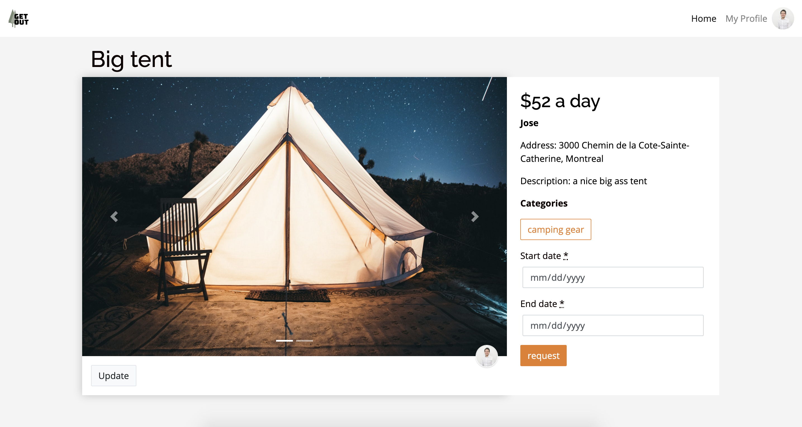
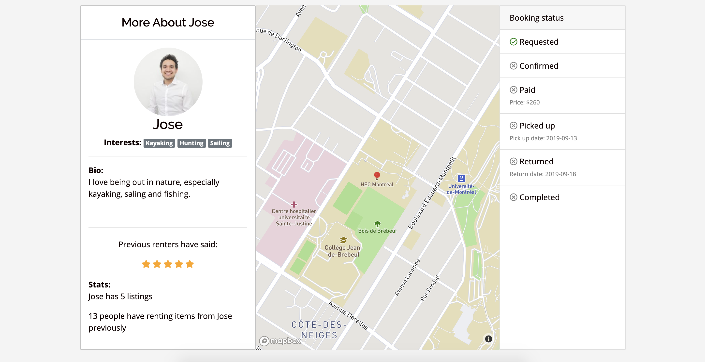

# GET OUT

An online market place, allowing users to rent outdoor sporting equipment. The app functions as a mock-up at this stage but integration with Stripe is possible.   

Created as a collaborative project by  <a href="https://github.com/zeajose">Jose Zea</a>, <a href="https://github.com/tomkf">Thomas Ferris</a>, <a href="https://github.com/gfmar">Gustaf Folkmar</a>, and <a href="https://github.com/jdilillo">Joe Di Lillo</a>

This full-stack web app was built with Ruby on Rails, HTML/CSS, and Java Script. 

## Live demo

https://get-out-bnbapp.herokuapp.com/

## ScreenShots

Homepage

 
Map

Product

 
Booking:

## Dependencies

-PostgreSQL
-Rails 5.2.3

## Running Locally  

To run on your local dev enviroment:
1. Clone the repository to a working directory
2. Install dependencies from the command line with  'bundle install'
3. Run command 'yarn install'
4. Create local db with command 'rails db:create db:migrate'
5. Run the server with command 'rails s' and visit http://localhost:3000/ in your browser.
